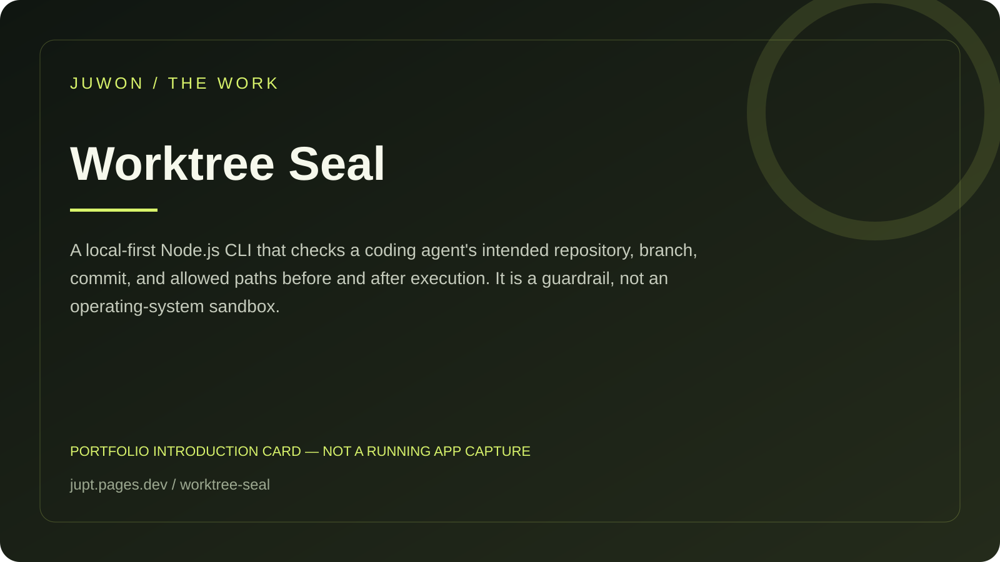

<!-- JUWON-PORTFOLIO-INTRO:START -->
# Worktree Seal



*Portfolio introduction card, not a screenshot of a running application.*

*포트폴리오 소개 카드입니다. 실행 화면 캡처가 아닙니다.*

## English

A local-first Node.js CLI that checks a coding agent's intended repository, branch, commit, and allowed paths before and after execution. It is a guardrail, not an operating-system sandbox.

[View JUWON's portfolio](https://jupt.pages.dev/) · [Browse the project collection](https://jupt.pages.dev/projects)

**Scope:** This README presents the repository's documented intent and recorded visual evidence. It does not certify that every feature is complete, deployed, or currently working. Follow the original setup, safety, and license documentation below.

## 한국어

코딩 에이전트가 잘못된 프로젝트나 파일을 수정하지 않도록 작업 범위를 고정하는 도구.

[JUWON 포트폴리오 보기](https://jupt.pages.dev/) · [전체 프로젝트 보기](https://jupt.pages.dev/projects)

**확인 범위:** 저장소의 문서상 목적과 기록된 화면 근거를 소개합니다. 모든 기능의 완성·배포·현재 정상 작동을 보증하지 않습니다. 설치법·안전 주의사항·라이선스는 아래 기존 문서를 확인하세요.
<!-- JUWON-PORTFOLIO-INTRO:END -->

---

## Original documentation / 기존 문서

# 🧷 Worktree Seal

**Stop coding agents from editing the wrong project or the wrong files.**

AI coding tools are powerful, but a second chat, a reused terminal, or a moved worktree can silently put an otherwise good change in the wrong repository. Worktree Seal turns the intended workspace into a small, reviewable contract:

```text
your agent command
        │
        ▼
┌──────────────────────────┐
│ Worktree Seal             │
│ root · remote · branch   │  ← before the command
│ commit · changed paths   │  ← after the command
└────────────┬─────────────┘
             │
       ✅ allowed / 🛑 blocked
```

It is a **zero-dependency, local-first Node.js CLI**. It stores its metadata inside `.git`, never calls a cloud service, never reads credentials, and never changes tracked files by itself.

## The 30-second flow

```bash
git clone https://github.com/juwonllee2024-dotcom/worktree-seal.git
cd worktree-seal
npm ci

# Run these from the repository that your agent is allowed to edit.
node bin/worktree-seal.mjs init
node bin/worktree-seal.mjs arm --allow src,test,docs
node bin/worktree-seal.mjs run -- npm test
```

For a globally installed checkout:

```bash
npm install -g .
worktree-seal init
worktree-seal arm --allow src,test
worktree-seal run -- your-agent-command --prompt "fix the failing test"
```

## What is checked?

`init` binds the current repository root, `origin` URL, branch, and `HEAD` commit. `arm` adds a narrow relative-path allowlist. `run` performs two checks:

1. **Before:** the command must be in the sealed root, on the sealed remote/branch/commit, with no changed path outside the allowlist.
2. **After:** any new or modified path outside the allowlist blocks the result and returns exit code `3`.

Use `check --json` when a wrapper, editor, or CI job needs machine-readable reasons:

```bash
worktree-seal check --json
```

Example blocked result:

```text
BLOCKED C:\projects\billing
  PATH_NOT_ALLOWED: Changed path is outside the armed allowlist: .env
```

The command returns a non-zero status when a seal is missing, the workspace identity changed, or a path is outside the allowlist. A blocked run is intentionally **not** auto-reverted: review remains in your hands.

## Why this exists

This is a narrow guard for a real failure mode in agent-assisted development. Reports in [VS Code #316051](https://github.com/microsoft/vscode/issues/316051) describe file context crossing between concurrent agent sessions; [Codex #24224](https://github.com/openai/codex/issues/24224) reports workspace-root leakage during concurrent sessions. Worktree Seal addresses the boundary that a generic “current directory” check misses: **identity before the command, and the actual diff after it**.

## Safety model

- **Default deny:** no allowlist means no armed run.
- **Explicit scope:** paths are relative to the sealed repository; traversal and absolute paths are rejected.
- **Reviewable:** seal metadata is plain JSON under `.git`; tracked files stay untouched.
- **Reversible:** `run` only blocks/returns a status; it does not delete, reset, revert, commit, push, or install anything.
- **Local-first:** no server, account, telemetry, model, or network request.

### Important limitation

Worktree Seal protects commands launched through `worktree-seal run -- ...`. It is not an OS sandbox and cannot undo a command after it has written a disallowed file. Put the wrapper at the point where your agent, task runner, or editor launches the command, and still review the diff.

## Development

```bash
npm ci
npm test
npm run check
npm run verify
```

The test suite uses temporary Git repositories to verify the full flow: seal, allowlist, pre-run identity checks, post-run path checks, JSON output, and missing-seal behavior.

## Contributing

Small, focused pull requests are welcome. See [CONTRIBUTING.md](CONTRIBUTING.md) and [SECURITY.md](SECURITY.md) before opening an issue.

## License

MIT © 2026 Worktree Seal contributors. See [LICENSE](LICENSE).

